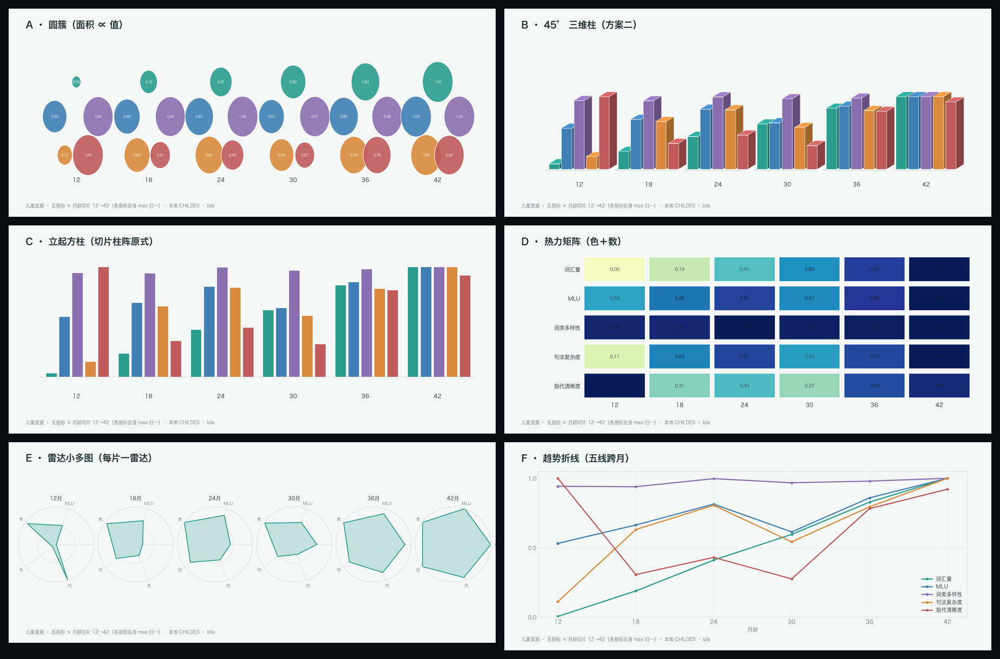

# 儿童发展切片柱阵 · 多形式对照集（v01）

> **主人 1003 令**：「多出几种形式，比较哪种**更易理解、更美观**；方案二存为迭代，之前的格式也保留。」
> **同一个数据**（本地 CHILDES，五指标 × 六月龄切片 12→42，各指标自身 max 归一），**六种呈现**：



| 式 | 编码 | 长处 | 短处 |
|---|---|---|---|
| **A · 圆簇** | 面积 ∝ 值 | 五指标**同框**、增长感直观 | 面积感知不精确；上下排布略花 |
| **B · 45° 三维柱** | 高＋退向 | 有**体积感/纵深感**、像模型 | 退向致叠压；精确读数难 |
| **C · 立起方柱** | 高 ∝ 值（分组柱） | **最易精确比较**（同基线同高） | 稍平；无"切片"纵深感 |
| **D · 热力矩阵** | 色＋数 | **读数最准**（数字直给）、跨指标一览 | "发育感"弱；像表格 |
| **E · 雷达小多图** | 形状 ∝ 五维 | **每片形状＝该月"指纹"**，形状变化一眼见 | 跨片比较需来回看；半径易误判面积 |
| **F · 趋势折线** | 五线跨月 | **趋势/拐点最清**（回落看得见） | 丢"切片"共现感；五线交缠 |

**初判**：**要"横截面共现"→ C 柱／D 热力**；**要"形状指纹"→ E 雷达**；**要"趋势与拐点"→ F 折线**；
**要"整体观感/海报感"→ A 圆／B 三维柱**。请主人圈一（或多）作正稿。

## 诚实条款

- 数据：本地 CHILDES Brown+Bernstein（CHI，`%mor`/`%gra` 直取）；12 月片样本薄 †。
- 各指标 max 归一；**跨指标勿横比**。未上站、未入碑。

## 目录 / 跑法

```
var-A-circles.png · var-B-iso-bars.png · var-C-pillars.png
var-D-heatmap.png · var-E-radar.png · var-F-lines.png · compare.png
```

```bash
cd cora-atlas
VER=v02-xxx .venv/bin/python scripts/fig_child_dev_variants.py
```

图：lola · cora-atlas · 2026-10-03
