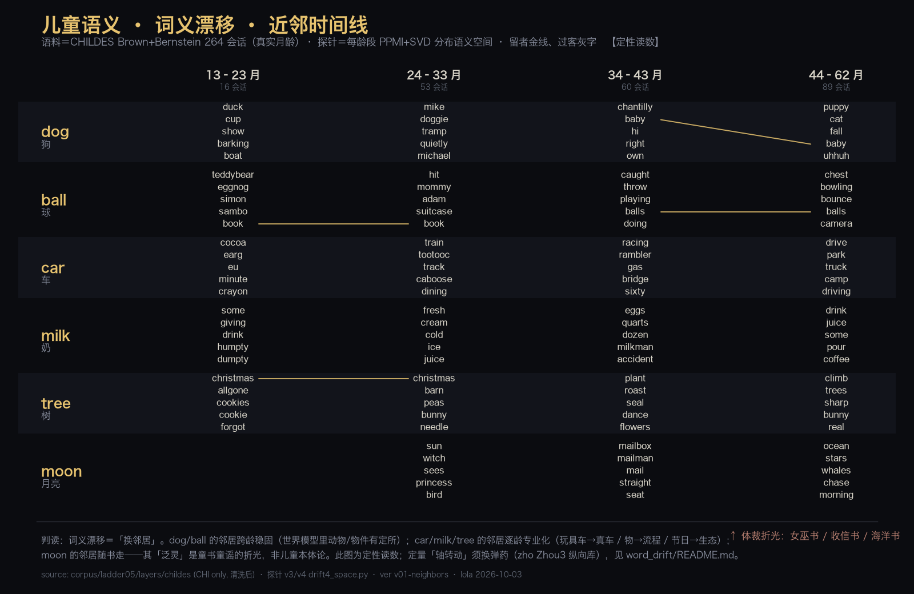

# 儿童语义 · 词义漂移 · 近邻时间线（v01）

> **缘起（主人 1003）**：「密度图作为之后，再考虑儿童语义的变化情况」→ 圈 **B · 词义漂移** →
> 探针链 `corpus/ladder05/analysis/word_drift/`（v0→v4）跑完 → 主人点 **A · 做图**。
> 本图即那条链的**定性读数**。



## 怎么读

- **每词一行**（dog/ball 为锚，car/milk/tree 为追，moon 为题眼）；**四龄段四列**（13–23 / 24–33 / 34–43 / 44–62 月）。
- 每格＝该词在该龄段的**近邻**（分布语义空间 PPMI+SVD 的余弦近邻）。
- **同一近邻若跨龄留下，就以金线相连**（留者金、过客灰字）。
- 语料＝本地 CHILDES **Brown + Bernstein 264 会话**（真实月龄，仅取 CHI 儿童自身产出，清洗后）。

## 三条读

1. **锚词稳**：dog 的邻居始终在动物族（doggie/puppy/cat/baby），ball 的邻居始终在玩法族
   （hit→throw/playing→bowling/bounce）——**世界模型里动物/物件有定所**。
2. **追词专业化**：car 从 `train·caboose·track`（玩具车）→ `racing·gas` → `drive·park·truck`（真车驾驶）；
   milk 从 `bottle·drink` → `cream·cold` → `juice·pour`；tree 从 `christmas·cookies`（节日符号）→ `climb·rabbit·owl`（植物/生态）。
3. **moon 随书走**：`witch·game` → `mailman·mail` → `ocean·whales`——**其「泛灵」是童书童谣的折光，非儿童本体论**（P2 立）。

## 诚实条款

- 此图是**定性**读数。探针链 v4 的**跨龄空间对齐弱**（Procrustes 残差 0.89–0.94 vs 随机正交 1.27–1.38，
  且语境扩到含母亲输入同水平）⇒ **「世界模型的轴转了多少」这份语料答不了**，故本图不宣称任何「轴变动量」。
- v0/1/2 三版探针已判死（循环 / 全局混淆 / 单词句孤立）；失败全程留痕于 `word_drift/`。
- **未上站、未入碑**，候主人勘定。

## 复算

```bash
cd cora-atlas
.venv/bin/python scripts/fig_word_drift.py        # 依赖 corpus/ladder05/analysis/word_drift/drift*.py
VER=v02-xxx .venv/bin/python scripts/fig_word_drift.py
```

图：lola · cora-atlas · 2026-10-03
